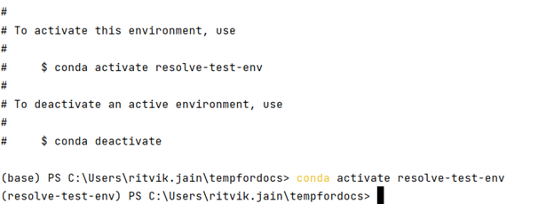

# Initial Model Set-up


This Section will walk you through on how to install and set up the model.
A lot of this should only be one-time so please make sure that this process is carried out carefully.

## All about environments

Python environments for this project should be thought of as isolated computational spaces 
that will have the necessary configurations needed for you to run the specific project or model - which in this case is `Resolve`

Environments help in setting up packages, dependencies, libraries etc by running a simpe command and do not require much computational 
background and knowledge - thus enabling the usage of the product for a wide array of stakeholders. 

There are many softwares that help in creating, activating and maintaining environments - one of which is `Anaconda`

We recommend using the [Anaconda](https://www.continuum.io/downloads) Python distribution and package manager. 
During the installation process, we recommend selecting the "Add Anaconda3 to my `PATH` environment variable" option
so that you have easy access to the `conda` command from the command line.

```{tip}
If you run into any `conda not recognized` or `command not found: conda` messages in the command line in the following steps,
this means that you **did not** add Anaconda to your PATH. You can add either rerun the installer (easiest) or manually
add Anaconda to your PATH (see [these instructions](https://www.geeksforgeeks.org/how-to-setup-anaconda-path-to-environment-variable/) for some help).
```

## Initial `conda` Set-up

In order for `conda` to work properly, you will need to initialize your "shell" (command line, e.g., Command Prompt). 

:::::{dropdown} Windows

````{dropdown} Option 1: Using Command Prompt
If you use Command Prompt, open a new Command Prompt window and enter:

```
conda init cmd.exe
```
````

````{dropdown} Option 2: Using PowerShell
If you use PowerShell, open a new PowerShell window and enter:

```
conda init PowerShell
```
 
Then, close all PowerShell windows, and open a new PowerShell window using the "Run as 
Administrator" option (right-click on the PowerShell application icon in the Start Menu to find this option). Then, enter the following command: 
 
```
Set-ExecutionPolicy Unrestricted
```

Then, close the PowerShell window and open a new one. 
````

:::::

````{dropdown} macOS Terminal
Since macOS Catalina (10.15), the default "shell" program is `zsh`. These instructions assume you're on a recent version of macOS. 
Open Terminal and use the following command:  

```
conda init zsh
```
Earlier versions of macOS use `bash`, so replace `zsh` in the command above with `bash`.

````

----

## Creating Environments 
Once you have `Anaconda` set-up and have the necessary `Resolve` files and folders you are ready
to create environments.

We will use the `conda` command to create an isolated environment for the Resolve to run within, without 
disturbing any other Python packages you may have already installed (see the [`conda` documentation](https://docs.conda.io/projects/conda/en/latest/user-guide/tasks/manage-environments.html) for more details on conda environments).

To create the `conda` environment, we will use the [`environment.yml`](https://github.com/e3-/kit/blob/main/environment.yml) 
file at the top level of the repository. Open your shell of choice and navigate into your cloned copy of the repository.
Then, run the following command:

-  Create an environment called `resolve-env`:
    ```bash
    conda env create -f environment.yml
    ```
- In general it is best practice to name your environment for better tractability. That can be as follows:

     ```bash
    conda env create -f environment.yml --name your-environment-name 
    ```

---

### Environments using Pycharm 

It is also possible for users to directly use Pycharm as an interface to create and manage Python 
based environments for Resolve.

Step 1: Navigate over to your Resolve specific folder on Pycharm - make sure that the file environment.yml is at
the top of the directory

Step 2: At the bottom left of your Pycharm Window, click on the terminal icon to open up the terminal.
This should show your selected directory 

step 3: In the terminal enter the following code 

-  Create an environment called `resolve-test-env`:
    ```bash
    conda env create -f environment.yml --name resolve-test-env
    ```
Note that the name of the environment is non-consequential and can be set per user's preference.

Once you enter the code, it will take about 2-5 minutes for the system to setup your environment - note that this is a
one-time exercise. 

After the installation is done - the terminal will prompt you to either activate or de-activate the environment, which will look
as follows:



Activating the environment would mean that you now have the virtual computing capabilities to run the model.
If you would like to learn more about virtual environments and dependencies, supplemental information can be found [here](https://www.geeksforgeeks.org/python-virtual-environment/#:~:text=A%20Python%20Virtual%20Environment%20is,a%20virtual%20environment%20in%20Python)

```{tip}
In order to maintain compatability between different versions, and updates of Resolve, it is best practice to use 
new environments for each new release. Environments do not interact with one another and this would make sure that the user
is able to switch back and forth between different resolve versions with ease.
```


### Solvers (optional) for the most part 

{bdg-info-line}`Optional`

The `resolve-env` environment comes with the open-source [`HiGHS`](https://highs.dev/) solver, which enables 
out-of-the-box solving of`Resolve` cases on any platform. 
Commercial solvers like Gurobi, IBM CPLEX, and FICO XPRESS offer additional solver features & 
typically substantially faster solve times. If you have licenses for any of these solvers, `Resolve` will work with them; 
follow the vendor installation & licensing instructions.

[Add point regarding runtime based on solvers]


