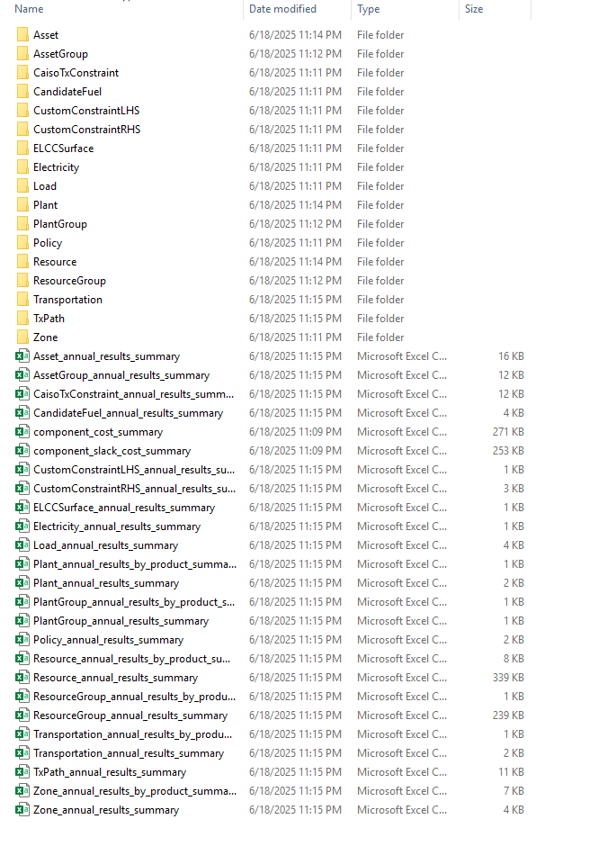
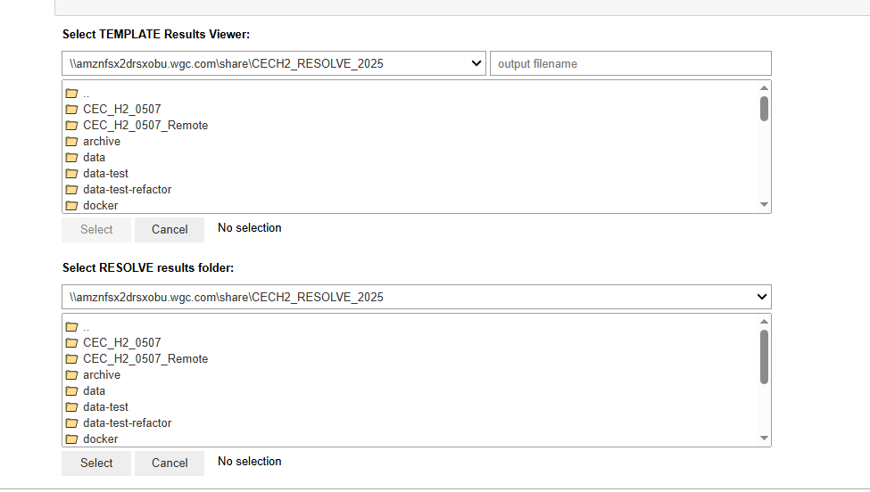
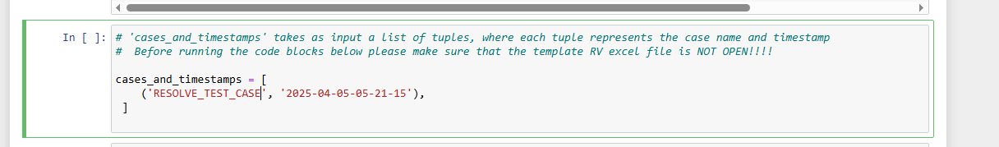
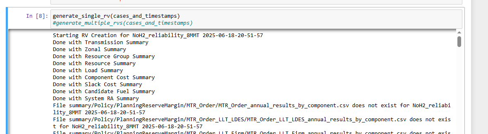

# RESOLVE Results Viewing

Once RESOLVE is done solving, it will save a series of CSVs that summarize the portfolio investment and operational decisions. These files are stored in the run’s report folder, which is found in  
./reports/resolve/[case name]/[timestamp]/

Once you have a RESOLVE case fully done, the output directory structure will look something similar to this:

The output file size will also be dependent on the case settings and components, for example, including hourly and raw results might amplify the file size and outputs.

As there is a myriad of information, it is not convenient to open each file and explore and therefore, having a centralized result viewer becomes very important.

The package will consist of three components that will help users retrieve and explore raw results using a tailor-made results viewer.

The results viewer is an excel based workbook that has inbuilt formulas and methods that digests the individual CSVs and provides comprehensive information on the entire system.

Users can load specific case results into Results Viewer using (1) An interactive Jupyter notebook script (recommended) or (2) Excel based macros in the RV Workbook. Additional script is made available to aggregate hourly results which is totally optional and recommended if hourly data review is needed.

## Option 1: Using the interactive Jupyter Notebook:

Within the RESOLVE package, users can find a Jupyter notebook script called “RV_script.ipynb” – it is recommended that users use a Python version greater than v3.7.0 to use this.

Once the script is opened using Jupyter Notebook or Jupyterhub, users can work with this without having to reactivate the environment or related dependencies. Note that the script is designed to work independently.

As you run the first couple blocks of code, you will be asked to enter the file path of results folder and the Results Viewer Workbook itself, which will be a part of the package as well.

This is what that selection process should look like:

Once you have confirmed the selection, you would need to add the name of the case and the timestamp of it that you want loaded, this input would go here:

Additionally, there are clear instructions in the RV as well that should help guide users during this process.

Note that users have the option to select loading one case at a time or a batch of cases. It is recommended that starting out users select just the one case option.

Once this is done, users can move ahead to the `generate_rv` function, after which depending on the options that have been specified, you either run a single or multiple case while commenting out the one which is not required.

As soon as this happens, the script will start loading in the RV and the script will provide updates as follows:

After this the users can find the Results viewer in the folder specified.

Note that this is a computationally intense process and depending on the size of the case can take about 30 minutes to load one case.

## Optional Hourly Results Processing Jupyter Notebook

In addition to viewing annual results, one may be interested in viewing and analyzing hourly model results. This is only possible if the “report_hourly_results” argument in the attributes.csv file for the case is set to TRUE, which tells RESOLVE whether to save hourly results to the case reports folder. If hourly results are included in the case reports folder, you can analyze them with the “RESOLVE Hourly Results Viewer.ipynb” Jupyter notebook within the “notebooks” directory of the kit repository.

The hourly results viewer notebook provides a workflow for analyzing and visualizing hourly and chronological dispatch results from RESOLVE model outputs. The user is guided to select a local directory containing RESOLVE case results and a destination folder for output via interactive file choosers. It is recommended that the case results be stored locally to increase the speed of importing the results into the notebook. If you would like to aggregate certain resources into aggregate groups for analysis, the user can optionally select an Excel Results Viewer workbook, which should contain two named ranges on the “Resource Groupings” worksheet: one for assigning resources to "Build Groups" and another for defining color settings and chart ordering for those groups. This setup enables streamlined downstream plotting of dispatch data either by grouped resource types or individual resources.

The user then has the option to export hourly load-resource balance results (that is, generation, load, zonal imports and exports, and battery charge and discharge results) for each specified zone and modeled year. Moreover, one can create hourly dispatch plots for a specified dispatch window (a.k.a. representative period) with the resource aggregation and color coding defined in the Excel Results Viewer workbook.

Figure 1. Example of hourly results aggregation and dispatch plots
