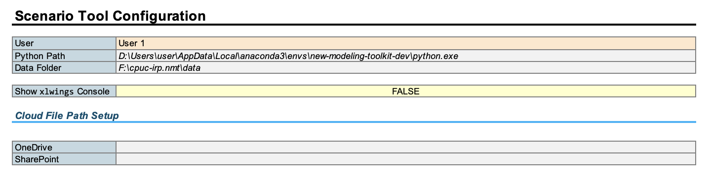

(getting_started)=
# Installation

(setting-up-conda)=
## Set Up the `resolve-env` `conda` Environment

We recommend using the [Anaconda](https://www.continuum.io/downloads) Python distribution and package manager. 
During the installation process, we recommend selecting the "Add Anaconda3 to my `PATH` environment variable" option
so that you have easy access to the `conda` command from the command line.

```{note}
If you run into any `conda not recognized` or `command not found: conda` messages in the command line in the following steps,
this means that you **did not** add Anaconda to your PATH. You can add either rerun the installer (easiest) or manually
add Anaconda to your PATH (see [these instructions](https://www.geeksforgeeks.org/how-to-setup-anaconda-path-to-environment-variable/) for some help).
```

In order for `conda` to work properly, you can either use the "Anaconda Prompt" application that comes packaged with 
your installation, or you will need to initialize your shell (command line, e.g., Command Prompt) of choice for use. 

````{dropdown} Using Command Prompt
If you use Command Prompt, open a new Command Prompt window and enter:

```commandline
conda init cmd.exe
```
````

````{dropdown} Using PowerShell
If you use Powershell, open a new Powershell window and enter:

```commandline
conda init powershell
 ```
 
Then, close all Powershell windows, and open a new Powershell window using the "Run as 
Administrator" option (right-click on the PowerShell application icon in the Start Menu to find this option). Then, enter the following command: 
 
```commandline
Set-ExecutionPolicy Unrestricted
```

Then, close the Powershell window and open a new one. 
````

We will use the `conda` command to create an isolated environment for the Resolve to run within, without 
disturbing any other Python packages you may have already installed (see the [`conda` documentation](https://docs.conda.io/projects/conda/en/latest/user-guide/tasks/manage-environments.html) for more details on conda environments).

To create the `conda` environment, we will use the [`environment.yml`](https://github.com/e3-/kit/blob/main/environment.yml) 
file at the top level of the repository. Open your shell of choice and navigate into your cloned copy of the repository.
Then, run the following command:

-  Create an environment called `resolve-env`:
    ```commandline
    conda env create -f environment.yml
    ```

- To activate the environment, set it as the project default in your IDE or use the following command:
    ```
    conda activate resolve-env 
    ```

---

## Install Solvers

### CBC
[CBC](https://github.com/coin-or/Cbc) is a free, open-source solver. 
A Windows executable is included in the `./solvers` subdirectory to allow users to run a test case out-of-the box. 

For macOS and Linux systems, we do not include the corresponding executables (which are different than the Windows one). 
You have two options for installing CBC:
1. Use Anaconda to install CBC in your `kit` conda environment (see {ref}`setting-up-conda`):
```
conda install -c conda-forge coincbc
```
2. Select the corresponding CBC from the AMPL open-source solver download page ([link](https://ampl.com/products/solvers/open-source/)).

### Commercial Solvers

Thanks to the underlying Pyomo package, commercial LP/MIP solvers like [Gurobi](https://www.gurobi.com/), IBM CPLEX, and FICO XPRESS are all supported. 
These commercial solvers are subject to additional costs and licensing for the user but **substantially** faster than `cbc. 
Follow the vendor installation & licensing instructions. 


---

## Setting Up the Scenario Tool

On the Scenario Tool's `Cover & Configuration` tab, you will need to tell the Scenario Tool how to find your `resolve-env` 
Python environment and the data folder where you want to save inputs:
- For your `resolve-env` Python path, open a command line and activate the environment using `conda activate resolve-env`. 
  Then type `where python`. The path should look something like `C:/Users/[username]/AppData/Local/Anaconda3/envs/resolve-env/python/exe` 
  on Windows or `/Users/[username]/anaconda/envs/resolve-env/bin/python`
- By default the data folder is called `./data`, but you can rename it to another name as desired.



### Configuring xlwings on macOS
Users using the spreadsheet tools on macOS need to do one more step the first time they set up kit environment (due to how macOS deals with permissions):

1. Open `Terminal` or your command line of choice
2. Activate the `resolve-env` environment
3. Run the command `xlwings runpython install`
4. You should see a prompt from macOS asking you for permission for Terminal to automate Excel. Allow this.

5. That's it!