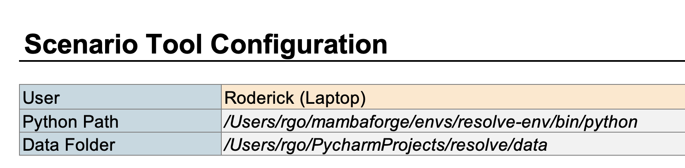

(getting_started)=
# Installation

This version of `Resolve` requires Python 3 and either Office 365 Excel, Excel 2021, or later. This page 
goes through instructions to set up `Resolve` on your computer.

## System Requirements
- Supported Operating Systems: 
  - Windows: Has been tested on Windows 10, Windows 11, and Windows Server 2022
  - macOS: Has been tested on macOS Big Sur (macOS 11) and above.
  - Linux: Has been run on Ubuntu, but other distributions may work. Notably, Excel Scenario Tool does **not** work 
    (since Excel is not available on Linux)
- Python: 3.9+ (via Anaconda distribution)
- Excel: Excel for Microsoft 365, Excel 2021, or later

## Download or Clone the `Resolve` Code

The latest release of `Resolve` can be downloaded from [GitHub](https://github.com/e3-/resolve/releases/latest)

:::{admonition} 2023 CPUC IRP {octicon}`zap`
Stakeholders for the 2023 California Public Utilities Integrated Resource Planning (2023 CPUC IRP) process can download 
`Resolve` and additional data, ruling case results directly from the [2022-23 IRP Events & Materials page](https://www.cpuc.ca.gov/industries-and-topics/electrical-energy/electric-power-procurement/long-term-procurement-planning/2022-irp-cycle-events-and-materials).
:::

---

(setting-up-conda)=
## Set Up the `resolve-env` Environment

We recommend using the [Anaconda](https://www.continuum.io/downloads) Python distribution and package manager. 
During the installation process, we recommend selecting the "Add Anaconda3 to my `PATH` environment variable" option
so that you have easy access to the `conda` command from the command line.

```{tip}
If you run into any `conda not recognized` or `command not found: conda` messages in the command line in the following steps,
this means that you **did not** add Anaconda to your PATH. You can add either rerun the installer (easiest) or manually
add Anaconda to your PATH (see [these instructions](https://www.geeksforgeeks.org/how-to-setup-anaconda-path-to-environment-variable/) for some help).
```

### Setting Up `conda` for the First Time

In order for `conda` to work properly, you will need to initialize your "shell" (command line, e.g., Command Prompt). 

````{dropdown} Option 1: Using Command Prompt
If you use Command Prompt, open a new Command Prompt window and enter:

```
conda init cmd.exe
```
````

````{dropdown} Option 2: Using PowerShell
If you use Powershell, open a new Powershell window and enter:

```
conda init powershell
 ```
 
Then, close all Powershell windows, and open a new Powershell window using the "Run as 
Administrator" option (right-click on the PowerShell application icon in the Start Menu to find this option). Then, enter the following command: 
 
```
Set-ExecutionPolicy Unrestricted
```

Then, close the Powershell window and open a new one. 
````

````{dropdown} Option 3: Using macOS Terminal
Since macOS Catalina (10.15), the default "shell" program is `zsh`. Earlier versions of macOS use `bash`, 
so replace `zsh` in the command below with `bash`.

```
conda init zsh
```
````

### Creating the Environment

We will use the `conda` command to create an isolated environment for the Resolve to run within, without 
disturbing any other Python packages you may have already installed (see the [`conda` documentation](https://docs.conda.io/projects/conda/en/latest/user-guide/tasks/manage-environments.html) for more details on conda environments).

To create the `conda` environment, we will use the [`environment.yml`](https://github.com/e3-/kit/blob/main/environment.yml) 
file at the top level of the repository. Open your shell of choice and navigate into your cloned copy of the repository.
Then, run the following command:

-  Create an environment called `resolve-env`:
    ```
    conda env create -f environment.yml
    ```

- To activate the environment, set it as the project default in your IDE or use the following command:
    ```
    conda activate resolve-env 
    ```

---

## Configure `xlwings` for Scenario Tool

On the Scenario Tool's `Cover & Configuration` tab, you will need to tell the Scenario Tool how to find your `resolve-env` 
**Python path** and the **data folder** where you want to save inputs.



::::{dropdown} Windows Excel
**Configure Python Path:** 
1. Open Command Prompt or PowerShell and activate the environment with the command `conda activate resolve-env`
2. Type the command `where python` to see where the `resolve-env` version of Python is stored. This should look like: 
  `C:\Users\[username]\Anaconda3\envs\resolve-env\python.exe`. Paste this path into the **Python Path** cell.
  :::{warning}
  Make sure to use a backslash `\` (and not a forward slash `/`) on Windows for the Python path. 
  :::
**Configure Data Folder Path:** 

By default, this folder is called `data` and located in the project folder next to the `scr` folder. 
For completeness, type the full path to the data folder, may look something like `~/.../resolve/data`
::::

::::{dropdown} macOS Excel
**Configure Python Path:** 
1. Open Terminal and activate the environment with the command `conda activate resolve-env`
2. {bdg-warning}`First time setup only` Run the command `xlwings runpython install`. You should see a prompt from macOS 
   asking you for permission for Terminal to automate Excel. **You must allow this.**
3. Type the command `which python` to see where the `resolve-env` version of Python is stored. This should look like: 
  `/Users/[username]/.../anaconda3/envs/resolve-env/bin/python`. Paste this path into the **Python Path** cell.
  :::{warning}
  Make sure to use a forward slash `/` (and not a backslash `\`) on macOS for the Python path.
  :::
**Configure Data Folder Path:** 

By default, this folder is called `data` and located in the project folder next to the `src` folder. 
For completeness, type the full path to the data folder, may look something like `~/.../resolve/data`
::::

---

## Install Commercial Solvers {bdg-info-line}`Optional`

The `resolve-env` environment comes with the open-source `HiGHS` solver, which enables out-of-the-box solving of 
`Resolve` cases on any platform. Commercial solvers like Gurobi, IBM CPLEX, and FICO XPRESS offer additional solver features & 
typically substantially faster solve times. If you have licenses for any of these solvers, `Resolve` will work with them; 
follow the vendor installation & licensing instructions.

See [](./running_resolve.md) for instructions on how to change which solver `Resolve` uses.


That's it! 