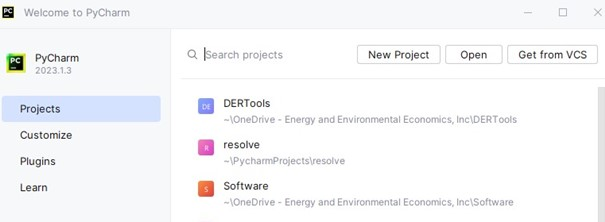
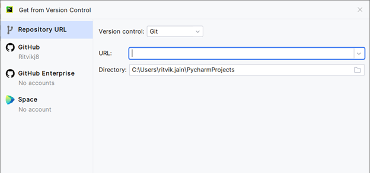
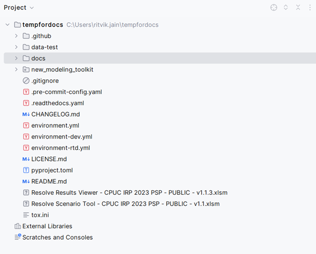
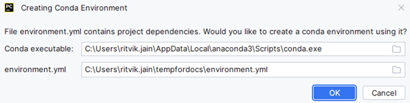

# Getting Started & Installation


This version of `Resolve` requires Python 3 and either Office 365 Excel, Excel 2021, or later. 
This page goes through instructions to set up Resolve on your local computer.

---
## System Requirements


- Supported Operating Systems: 
  - Windows: Has been tested on Windows 10, Windows 11, and Windows Server 2022
  - macOS: Has been tested on macOS Big Sur (macOS 11) and above.
  - Linux: Has been run on Ubuntu, but other distributions may work. Notably, Excel Scenario Tool does **not** work 
    (since Excel is not available on Linux)
- Python: 3.9+ (via Anaconda distribution)
- Excel: Excel for Microsoft 365, Excel 2021, or later
---

## Python Installation


The computational logic, optimization and associated code for `RESOLVE` is built in the `Python` programming language. 
Installing the right version and the related dependencies is very important to make sure that the code and the model runs as intended.

E3 recommends downloading the [Anaconda distribution package](https://www.anaconda.com/download) as this is an open source and widely used
distribution platform for working in python.

Depending on your operating system and local computer configurations, detailed instructions for set-up and installation can be found on this [website](https://docs.anaconda.com/anaconda/install/)

It is important to note there are other available platforms as well - as long as you have Python 3.9 + installed, you should be good. 

---

## Github


- `Resolve` uses a combination of Excel spreadsheets, Jupyter notebooks, and Python scripts. 
- [Github](https://github.com) helps in maintaining, operating and structuring these file types so that the user can work with 
the contents of the model seamlessly.
- The latest release of `Resolve` can be downloaded from [GitHub](https://github.com/e3-/resolve/releases/latest)
- You can use a python software distribution like PyCharm (Recommended by E3) that enables you to clone the repository.
- What is Cloning?
  - Cloning in GitHub means making a copy of a repository (a project or codebase) from GitHub to your local computer. 
  - Cloning is especially helpful as it helps keep track of changes to files/folders, maintain version control and revert back to
original files if need be. 

:::{admonition} 2023 CPUC IRP {octicon}`zap`
Stakeholders for the 2023 California Public Utilities Integrated Resource Planning (2023 CPUC IRP) process can download 
`Resolve` and additional data, ruling case results directly from the [2022-23 IRP Events & Materials page](https://www.cpuc.ca.gov/industries-and-topics/electrical-energy/electric-power-procurement/long-term-procurement-planning/2022-irp-cycle-events-and-materials).
:::

---

### Pycharm


If you are a user who plans to use the package repeatedly and would like to have version control set-up for different releases 
downloading and setting up Pycharm is highly recommended. 
One-time installation instructions for Pycharm can be found [here](https://www.jetbrains.com/help/pycharm/installation-guide.html) 

Once you have Pycharm installed, follow these steps in order to clone the `Resolve Repository`

**Step 1:** Open Pycharm and in the main menu toggle over to projects and click on *Get from VCS*

<br />



<br />

**Step 2:** After completing step 1, a new window should pop up as shown below. Click on 'Repository url'. make sure version control is 
set to 'Git', define the directory on your local computer where you would like the `Resolve` model to be saved (Recommended free space on loacl disk is ~10GiB)
In the URL section copy and paste the latest release of `Resolve` - which can be found [here](https://github.com/e3-/resolve)  

<br />



<br />

**Step 3:** Click on Clone at the bottom of the window and allow a couple minutes for Github to clone the repository.
The user should be able to see a small dialog box at the bottom of the Pycharm window that reads 'Cloning source repository'

Once this is completed, you should be able to see the necessary files and folders both within pycharm and in your selected local directory.
Which should look like the following. 

<br />



<br />

There is a possibility that Pycharm would ask you to create an environment with a pop-up that looks as follows.
We will get to this part later so the user can click 'Cancel' and move ahead for now. 

<br />



----

```{tip}
If you have downloaded the resolve package from the CPUC website and or downloaded the zipfile package, you can
still go into pycharm - go into the Menubar -> Files -> Open -> Select the folder where you downloaded unzipped resolve
and click OK. This enables you to work with existing files and/or circumvent the cloning process.
```

----

## Files & Data Structure 

Once you've downloaded or cloned the Resolve package, you should see (at a minimum) the following files & sub-folders:

* **LICENSE.md:** GNU AGPLv3 open-source license used for `Resolve`
  * **data/:** Data folder for any pre-existing data & case settings
  * **src/resolve/:** `Resolve` source code
* **environment.yml:** Python environment settings
* **pyproject.toml:** Python dependencies
* **User Guide** {bdg-warning}`.pdf`
* **Scenario Tool** {bdg-info}`.xlsm`
* **Results Viewer** {bdg-info}`.xlsm`

### 2023 CPUC IRP Files

The 2023 CPUC IRP release will also include additional files or files that have been renamed:
- **CPUC IRP Resource Cost & Build - PUBLIC** {bdg-success}`.xlsx`
- **Scenario Tool** → Resolve Scenario Tool - CPUC IRP 2023 PSP - PUBLIC - v1.1 {bdg-info}`.xlsm`
- **Results Viewer** → Resolve Results Viewer - CPUC IRP 2023 PSP - PUBLIC - v1.1 {bdg-info}`.xlsm`
- **results/:** Results for released 2023-23 PSP cases 

