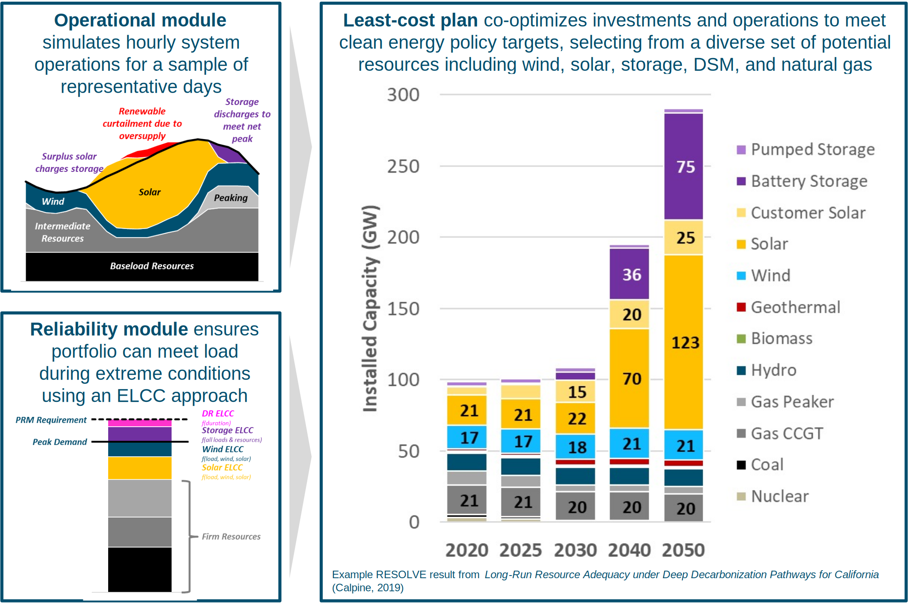
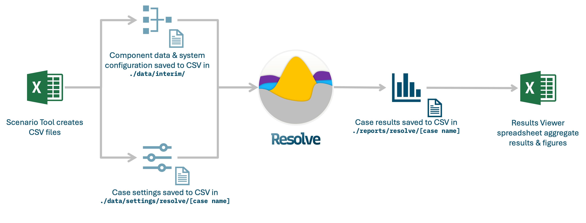

<!---
Resolve documentation master file, created by
sphinx-quickstart on Sun Feb 14 15:12:03 2021.
You can adapt this file completely to your liking, but it should at least
contain the root `toctree` directive.
-->

# Resolve

Welcome to the new `Resolve` documentation! These docs are periodically updated and improved for better user experience. 

`Resolve` is a least-cost capacity expansion model that identifies optimal electricity supply portfolios through capacity 
expansion and production simulation modeling. Optimal investment plans account for the capital costs of new resources, 
the variable costs of reliably operating the grid, and additional values such as environmental attributes. 
`Resolve` has been used to support resource planning and valuation for dozens of clients across North America.

More detailed information along with relevant projects and reports that have leaned on RESOLVE can be found on
[this webpage](https://www.ethree.com/tools/resolve/).




`Resolve` was initially developed in 2014 to assess the investment needs of systems seeking to integrate large quantities of variable renewable 
resources. In 2020, `Resolve` was re-developed from the ground up to study emerging questions around emerging technologies
(e.g., long-duration energy storage, electrolytic fuel production) thanks to funding by the California Energy Commission
([CEC EPC-19-056](https://www.energizeinnovation.fund/projects/assessing-long-duration-energy-storage-deployment-scenarios-meet-californias-energy-goals)).


## `Resolve` Data Flow

`Resolve` uses a combination of Excel spreadsheet, Jupyter notebooks, and Python scripts. 
This documentation will briefly cover each step.



---

## Contact Us

Please file [bug reports on GitHub](https://github.com/e3-/resolve/issues/new/choose).

For support from E3 staff related to the 2022-23 CPUC IRP proceeding, use [this booking link](https://outlook.office365.com/owa/calendar/ResolveInstallSupport@ethree.com/bookings/)

For any other questions or more information on `Resolve` and E3's other modeling tools, email us: <platform@ethree.com>.


### Kicking it off

Now that we have some background on what `Resolve` is, let's 
understand and walk through the steps of running `Resolve` and plan clean and reliable electric systems. 👷‍♂️🏗️

```{toctree}
:hidden:

getting_started/index
Initial Model Set-Up/index
World of Scenario Tool/index
Running Resolve/index
RESOLVE Results Viewing/index
FAQs/index

```

:::{toctree}
:caption: CPUC IRP Links
:hidden:

2022-23 CPUC IRP PSP <https://www.cpuc.ca.gov/industries-and-topics/electrical-energy/electric-power-procurement/long-term-procurement-planning/2022-irp-cycle-events-and-materials>
:::

:::{toctree}
:caption: CEC EPC-19-056 Links
:hidden:

CEC Project Page <https://www.energizeinnovation.fund/projects/assessing-long-duration-energy-storage-deployment-scenarios-meet-californias-energy-goals>
E3 Modeling Dataset <https://zenodo.org/doi/10.5281/zenodo.10866454>
Form Energy Dataset <https://zenodo.org/doi/10.5281/zenodo.8045595>
:::

:::{toctree}
:caption: E3 Links
:hidden:

E3 Homepage <https://www.ethree.com/>
:::