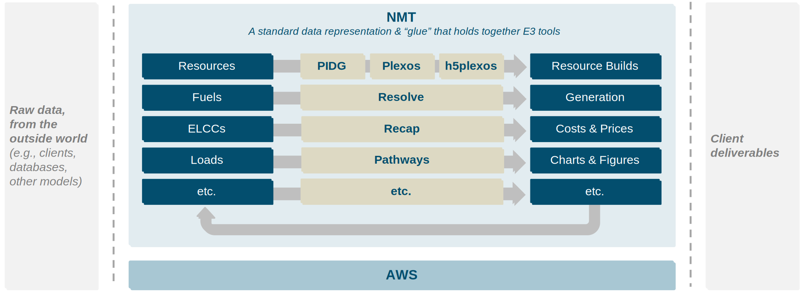

<!---
Resolve documentation master file, created by
sphinx-quickstart on Sun Feb 14 15:12:03 2021.
You can adapt this file completely to your liking, but it should at least
contain the root `toctree` directive.
-->
# Resolve

```{note}
Resolve documentation is being migrated from `kit`
repo to this one, so some documentation may still be on the [`kit` repo (linked here)](https://e3-kit.readthedocs-hosted.com/en/latest/)
```

```{toctree}
:hidden:

getting_started
basics/index
extras/index
concepts/index
system/index
cases/index
```

:::{toctree}
:caption: Other kit Tools
:hidden:

E3 Homepage <https://www.ethree.com/>
kit Docs <https://e3-kit.readthedocs-hosted.com/>
BE-Toolkit Docs <https://e3-be-toolkit.readthedocs-hosted.com/>
Pathways Docs <https://e3-pathways.readthedocs-hosted.com/>
Recap Docs <https://e3-recap.readthedocs-hosted.com/>
:::

Welcome to the new `Resolve` documentation! 

`Resolve` is an electricity resource planning model that identifies optimal long-term electric generation and transmission 
investments subject to reliability, policy, and technical constraints. 


Designed in 2014 to assess the investment needs of systems seeking to integrate large quantities of variable renewable 
resources, `Resolve` identifies optimal portfolios of renewable and conventional energy resources through capacity 
expansion and production simulation modeling. Optimal investment plans account for the capital costs of new resources, 
the variable costs of reliably operating the grid, and additional values such as environmental attributes. 
`Resolve` has been used to support resource planning and valuation for dozens of clients across North America.

## Relationship to Other E3 Tools

`Resolve` is built on top of `kit`, E3's next-generation energy system modeling platform, which will 
see the tools increasingly share components.




## Relationship to Other Capacity Expansion Models

`Resolve` is in the same family as other capacity expansion models, such as `GenX`, `GridPath`, `Plexos`, `PyPSA`, `Switch`. 
All of these models are variations on (mixed-integer) linear programming optimization models. 

### Relationship to `Plexos`

E3 will continue to use both `Resolve` and `Plexos`. 

| **`Resolve`**                                                           | **`Plexos`**                                                  |
|-------------------------------------------------------------------------|---------------------------------------------------------------|
| Research tool, with greater flexibility to develop custom functionality | Commercial tool, with commercial software support for clients |
| Greater focus on **proactive** capacity expansion                       | Greater focus on production simulation (ST)                   |


---
:::{eval-rst}
.. raw:: html

    <div class="giscus-container">
        <script src="https://giscus.app/client.js"
            data-repo="e3-/kit"
            data-repo-id="MDEwOlJlcG9zaXRvcnkzMjkxMzIyNzQ="
            data-category="Documentation"
            data-category-id="DIC_kwDOE54o8s4CWsWE"
            data-mapping="pathname"
            data-strict="0"
            data-reactions-enabled="1"
            data-emit-metadata="0"
            data-input-position="bottom"
            data-theme="preferred_color_scheme"
            data-lang="en"
            crossorigin="anonymous"
            async>
        </script>
    </div>

:::