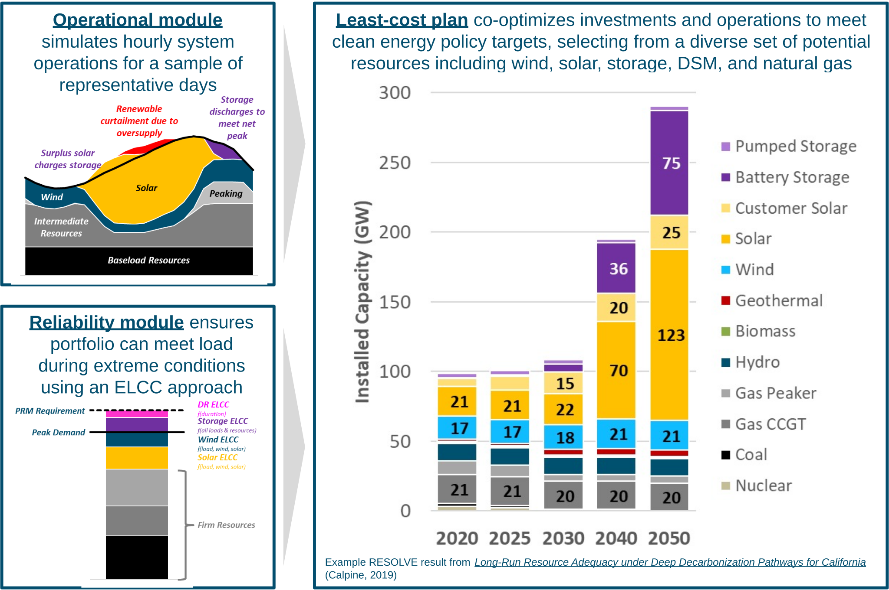
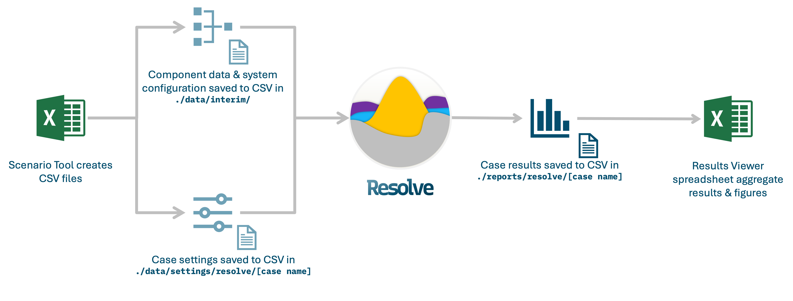

<!---
RESOLVE documentation master file, created by
sphinx-quickstart on Sun Feb 14 15:12:03 2021.
You can adapt this file completely to your liking, but it should at least
contain the root `toctree` directive.
-->

# RESOLVE

Welcome to the new `RESOLVE` documentation! These docs are periodically updated and improved for better user experience. Note that for most up-to-dated information, you are encouraged to visit the Github RESOLVE [repository](https://github.com/e3-/resolve).  

`RESOLVE` is a least-cost capacity expansion model that identifies optimal electricity supply portfolios through capacity 
expansion and production simulation modeling. Optimal investment plans account for the capital costs of new resources, 
the variable costs of reliably operating the grid, and additional values such as environmental attributes. 
`RESOLVE` has been used to support resource planning and valuation for dozens of clients across North America.

More detailed information along with relevant projects and reports that have leaned on RESOLVE can be found on
[this webpage](https://www.ethree.com/tools/resolve/).




`RESOLVE` was initially developed in 2014 to assess the investment needs of systems seeking to integrate large quantities of variable renewable resources. Since then, many new modeling features and developments are done to enhance the modeling capabilities. The latest version is RESOLVE 3.0, released in summer 2025.


## `RESOLVE` Data Flow

`RESOLVE` uses a combination of Excel spreadsheet, Jupyter notebooks, and Python scripts. 
This documentation will briefly cover each step.



---

## Contact Us

Please file [bug reports on GitHub](https://github.com/e3-/resolve/issues/new/choose).

For support from E3 staff related to the CPUC IRP proceeding, standing office hours are available on Wednesdays 9-10 AM (PST). In order to attend, you should register using [this link](https://forms.office.com/r/hf8GLfRZJk)

For any other questions or more information on `RESOLVE` and E3's other modeling tools, email us: <platform@ethree.com>.


### Kicking it off

Now that we have some background on what `RESOLVE` is, let's 
understand and walk through the steps of running `RESOLVE` and plan clean and reliable electric systems. 👷‍♂️🏗️

```{toctree}
:hidden:

getting_started/index
Initial Model Set-Up/index
User Guide <user_guide/index>
Running Resolve/index
RESOLVE Results Viewing/index
FAQs/index
2025 CPUC IRP Files/index
```

```{toctree}
:hidden:
:caption: Core Data Principles

2022-23 CPUC IRP PSP <https://www.cpuc.ca.gov/industries-and-topics/electrical-energy/electric-power-procurement/long-term-procurement-planning/2022-irp-cycle-events-and-materials>

2024-2026 IRP Cycle <https://www.cpuc.ca.gov/industries-and-topics/electrical-energy/electric-power-procurement/long-term-procurement-planning/2024-26-irp-cycle-events-and-materials>
:::


```{toctree}
:hidden:
:caption: Modeling an Energy System
system/index
system/buildings/index
system/electric/index
system/fuels/index
system/transportation/index
system/policies
system/markets
system/misc/index
```

```{toctree}
:hidden:
:caption: Models & Tools

pathways/index
recap/index
resolve/index
```

```{toctree}
:caption: Related Links
:hidden:

E3 Homepage <https://www.ethree.com/>
BE-Toolkit Docs <https://e3-be-toolkit.readthedocs-hosted.com/>
Pathways Docs <https://e3-pathways.readthedocs-hosted.com/>
Recap Docs <https://e3-recap.readthedocs-hosted.com/>
Resolve Docs <https://e3-resolve.readthedocs-hosted.com/>
```

# Kit

``kit`` is the **next generation** [Energy + Environmental Economics](https://www.ethree.com/) energy system modeling
platform, using modern Python. The goal of ``kit`` is to provide a **shared accounting framework for energy flows,
emissions & costs** across the entire energy system.

:::{attention}
``kit`` is very much a work-in-progress, as we work across E3 to bring our tools & perspectives better inline.
:::

For more information, contact us: <platform@ethree.com>

## Why a Unified Framework?

E3 has a myriad of tools trying to model different parts of the energy transition. As we continue to grow, 
we need shared "connective tissue" that ensures that our growing toolkit leverages the same fundamental assumptions, 
rather than relying on individual analysts.

:::{figure} ./_images/building-blocks.svg
:width: 75%
:align: center
Building blocks showing how tools should build on top of `kit` and fit together.
:::

## What's New

:::::{grid}
:padding: 0
:gutter: 2

::::{grid-item-card} **BE-Toolkit**
:columns: 4

Building electrification simulation & adoption

:::{dropdown} Details
:margin: 0 {bdg-success}`new`

:::

::::

::::{grid-item-card} **Resolve**
:columns: 4

Asset investment & operational model

:::{dropdown} Details
:margin: 0 {bdg-success}`new` Updated operational constraints for energy storage, including multi-day & seasonal storage

{bdg-success}`new` Flexible representation of hourly operations, enabling 8760-hour "production simulation" mode

{bdg-success}`new` More powerful custom constraints and more complex custom functionality (via :resolve.extras: module)

{bdg-success}`new` Flexible fuel blending for fuel-burning generators

{bdg-success}`new` Multi-dimensional ELCC surfaces

{bdg-warning}`soon` Co-optimized electrolytic fuel production & consumption across electric & non-electric sector
(i.e., cross-sectoral energy storage)

:::
::::

::::{grid-item-card} **Recap**
:columns: 4

Electric sector reliability & resilience model

:::{dropdown} Details
:margin: 0 {bdg-success}`new` Optimization-based dispatch of energy-limited resources

{bdg-success}`new` Refined calculation of reliability metrics (LOLP, LOLH, EUE, etc.)

{bdg-success}`new` Streamlined user experience to calculate resource & portfolio ELCCs

{bdg-success}`new` Hourly neural network for correlating load profiles to longer historical weather records

{bdg-warning}`soon` Modeling of extreme events to inform resilience studies

{bdg-warning}`soon` Improved operational modeling of flexible load resources

{bdg-warning}`soon` Streamlined interface with Resolve, enabling faster portfolio reliability checks
:::
::::

::::{grid-item-card} **Pathways**
:columns: 12

Economy-wide decarbonization scenario framework

:::{dropdown} Details
:margin: 0 {bdg-success}`new` Faster runtime, enabling faster scenario analysis

{bdg-success}`new` Improved early retirement logic

{bdg-success}`new` Granular reporting of multiple GHGs and pollutants ($CO_2$, $CH_4$, $N_2O$, $CO_2e$, etc.)

{bdg-success}`new` Separate accounting for new construction and existing building shell improvements

{bdg-warning}`soon` Open-source release

{bdg-warning}`soon` Co-optimized electrolytic fuel production & consumption across electric & non-electric sector
(i.e., cross-sectoral energy storage)
:::

::::

::::{grid-item-card} **`kit`**
:columns: 12

Shared data framework for scalable energy systems analysis

:::{dropdown} Details
:margin: 0 {bdg-success}`new` Streamlined user experience due to dramatically smaller & easier-to-use Excel dashboards

{bdg-success}`new` Standard representation of both electric and non-electric sectors

{bdg-success}`new` Standard input data "scenario-tagging" functionality to enable fast scenario & sensitivity analysis

{bdg-success}`new` Shared representation of weather year-indexed timeseries data

{bdg-warning}`soon` Publicly-accessible, online documentation (via this website)
:::
::::
:::::

## Indices and tables

See raw docstrings via the indices below:

* {ref}`genindex`
* {ref}`modindex`
* {ref}`search`

---

:::
