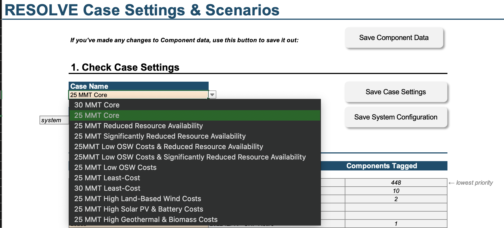
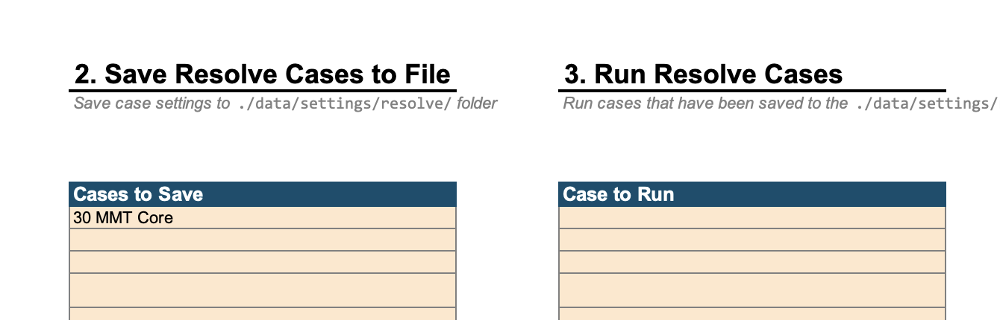

(inputs)=
# Using the Scenario Tool
Using the Scenario Tool can be thought of as three separate steps:

1. **Defining component & linkage attributes**: This is synonymous with creating the attribute CSV files in `./data/interim` and 
can be thought of as creating the conceptual "database" (in lieu of an actual database structure) of all the possible component & linkage options. 
2. **Defining a system**: This is synonymous with creating the `./data/interim/system` instance folder, listing out all the 
components & linkages that will constitute the system of study.
3. **`Resolve` case settings**: These are the specific case configuration options, such as modeled years & which scenario inputs to include.

```{image} _images/scenario-tool-steps.png
:alt: Screenshot of three "steps" of `Resolve` model setup, consisting of (1) defining component & linkage attributes, (2) defining a system, and (3) `Resolve` case settings. 
:width: 80%
:align: center
```

```{hint}
Users can configure which `data` folder to point the Scenario Tool to save to different `data` folders on the 
Cover & Configuration tab. This can be especially useful if your model's dataset is still in flux and you want to save 
older "snapshots" of the `data` folder for comparison. See [](comparing_cases.md) for tips on how to compare these folders.
```


### Component Attributes

The Resolve system being modeled is made up of various components, such as load components, resource, and policies. 
These components have attributes, such as heat rate, generation & load profiles, etc.

(scenario_tags)=
#### Scenario tagging functionality

See {ref}`input_scenarios` for discussion about how to determine which scenario tagged data is used in a specific model run. 

On most of the component & linkage attributes tabs, you will find a `Scenario` column. In the Scenario Tool, a single instance of 
a component can have **multiple** line entries in the corresponding data table as long as each line is tagged with a different scenario 
tag, as shown in the below screenshot. 

```{image} _images/resource-scenario-tags.png
:alt: Screenshot from Scenario Tool showing multiple scenario tags for the same resource.
:align: center
```

Scenario tags can be populated *sparsely*; in other words, every line entry for the same resource does not have to be fully populated 
across all columns in the data tables. In the example screenshot above, this is demonstrated by the `base` scenario tag having 
data for "Total (Planned + New) Resource Potential in Modeled Year (MW)" and no data for "All-In Fixed Cost by Vintage ($/kW-year)", 
whereas the scenario tags `2021_PSP_22_23_TPP` and `2021_PSP_22_23_TPP_High` are the reverse. 

#### Hourly load & generation profiles

Hourly load & generation profiles are found [on Box](https://willdan.box.com/s/ryhm8yi22jmzjrk2aalfzb00ium9n71h) due to the relatively large size of all the CSV files. 
Users should plan to download the folder and place the `profiles` folder inside `./data` (next to the `interim` subfolder). 

### System Setup

Currently, the system setup tab is dark blue. 

In the initial version of the Scenario Tool, users need to enumerate every component (e.g., resource, transmission path) and 
linkage (i.e., relationship between two components) to be included in the modeled `System` instance. Orange dropdowns help 
users select the correct data values for the component & linkage class names (e.g., `Asset` and `AllToPolicy`).

### `Resolve` Case Settings

#### Selecting Existing PSP Cases

The RESOLVE Case Settings tab is populated with the cases included in the PSP Ruling. Select a case from the dropdown to 
see what scenarios & case settings are used, as shown in the screenshot below:



To the right, save the case settings out and save the list of cases you want to run using the "2. Save Resolve Cases to File" and
"3. Run Resolve Cases" sections, as shown below:



#### Running `Resolve` Cases

The `Resolve` Settings tab is where users specify how `Resolve` should run, as well as providing 
a button that will run the code. The "Run `Resolve` Locally" button will run the equivalent command:

```
python run_opt.py --solver-name [solver name] --log-level INFO
```


---

:::{eval-rst}
.. raw:: html

    <div class="giscus-container">
        <script src="https://giscus.app/client.js"
            data-repo="e3-/kit"
            data-repo-id="MDEwOlJlcG9zaXRvcnkzMjkxMzIyNzQ="
            data-category="Documentation"
            data-category-id="DIC_kwDOE54o8s4CWsWE"
            data-mapping="pathname"
            data-strict="0"
            data-reactions-enabled="1"
            data-emit-metadata="0"
            data-input-position="bottom"
            data-theme="preferred_color_scheme"
            data-lang="en"
            crossorigin="anonymous"
            async>
        </script>
    </div>
:::