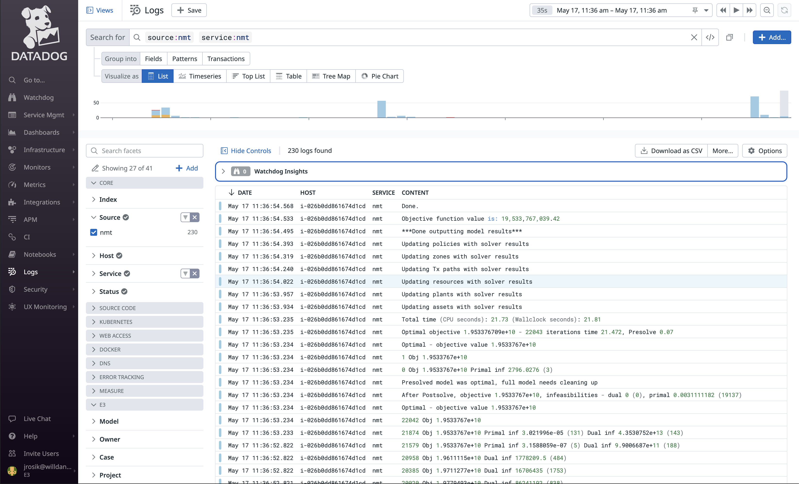
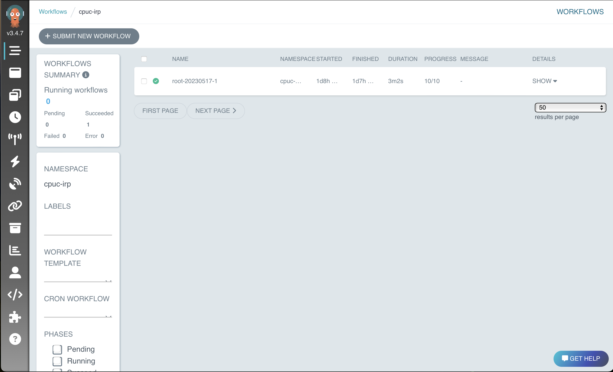

(running_resolve)=
# Running `Resolve`

## Running `Resolve` in "Desktop" Mode

If you plan to run `Resolve` on your laptop or an AWS EC2 instance, use the following instructions.

1. In a command line, navigate into the `./new_modeling_toolkit/resolve` directory
2. Activate the `new-modeling-toolkit` conda environment: `conda activate new-modeling-toolkit`
3. Use the command `python run_opt.py` to run a case. The `run_opt.py` script accepts four arguments/options:
    ```
     Usage: run_opt.py [OPTIONS] [RESOLVE_SETTINGS_NAME]                                    

    ╭─ Arguments ──────────────────────────────────────────────────────────────────────────╮
    │   resolve_settings_name      [RESOLVE_SETTINGS_NAME]  Name of a RESOLVE case (under  │
    │                                                       ./data/settings/resolve). If   │
    │                                                       `None`, will run all cases     │
    │                                                       listed in                      │
    │                                                       ./data/settings/resolve/cases… │
    │                                                       [default: None]                │
    ╰──────────────────────────────────────────────────────────────────────────────────────╯
    ╭─ Options ────────────────────────────────────────────────────────────────────────────╮
    │ --data-folder                               TEXT  Name of data folder, which is      │
    │                                                   assumed to be in the same folder   │
    │                                                   as `new_modeling_toolkit` folder.  │
    │                                                   [default: data]                    │
    │ --solver-name                               TEXT  [default: cbc]                     │
    │ --log-level                                 TEXT  Any Python logging level: [DEBUG,  │
    │                                                   INFO, WARNING, ERROR, CRITICAL].   │
    │                                                   Choosing DEBUG will also enable    │
    │                                                   Pyomo `tee=True` and               │
    │                                                   `symbolic_solver_labels` options.  │
    │                                                   [default: INFO]                    │
    │ --extras                                    TEXT  Enables a RESOLVE 'extras' module, │
    │                                                   which contains project-specific    │
    │                                                   add-on constraints.                │
    │                                                   [default: None]                    │
    │ --raw-results           --no-raw-results          If this option is passed, the      │
    │                                                   model will report all Pyomo model  │
    │                                                   components directly.               │
    │                                                   [default: no-raw-results]          │
    │ --help                                            Show this message and exit.        │
    ╰──────────────────────────────────────────────────────────────────────────────────────╯
    ```

```{note}
Hint: If you're in your command line and unsure what arguments to pass to `run_opt.py`, use the `--help` argument!
```

## Running `Resolve` on `ethree.cloud` Cluster

If you plan to submit jobs to the `ethree.cloud` Cluster, following the instructions below. 
For now, these commands differ from the "local" instructions described above, so follow carefully.

### One-Time Initial Setup

For every computer that you use to submit jobs to the cluster, you will need to do this initial setup:

1. Make sure you've installed the `new-modeling-toolkit` conda environment (see {ref}`setting-up-conda` for a refresher).
2. Install the [`aws-cli`](https://docs.aws.amazon.com/cli/latest/userguide/getting-started-install.html) and [`kubectl`](https://kubernetes.io/docs/tasks/tools/) by following the instructions on the linked pages.
3. Configure the `aws-cli` permissions by running these commands in Terminal, Command Prompt, PowerShell, etc.
   ```commandline
   aws configure set region us-west-2
   aws configure set sso_start_url https://d-9267736486.awsapps.com/start
   aws configure set sso_region us-west-2
   aws configure set sso_account_id 876451484466
   aws configure set sso_role_name DataUserAccess
   aws eks update-kubeconfig --name e3x-enkap-main --alias e3x-enkap-main
   ```
   - _**Note:** If you were granted a different AWS role (e.g. `PowerUserAccess`, `AdministratorAccess`), you can enter that in the last line (`sso_role_name`) instead of `DataUserAccess`._
4. Configure `kubectl` and test your configuration using the following commands:
   ```commandline
   kubectl config set-context --current --namespace cpuc-irp
   kubectl get pods
   ```
   This should return something like:
   ```commandline
   NAME                                                 READY   STATUS    RESTARTS      AGE
   argo-workflows-server-5f96bf68cf-7fdfv               1/1     Running   0             14d
   argo-workflows-workflow-controller-d6cf98c86-xl7cc   1/1     Running   1 (43h ago)   14d
   ```
5. Activate the `new-modeling-toolkit` conda environment (see {ref}`setting-up-conda` for a refresher).
6. From your `new-modeling-toolkit` project folder, set up your project using the command `nmt init cpuc-irp`. 
   This will create a file called `.nmt.config.json` in your project folder to configure the following command settings:
   - **"data":** The name of the data folder to upload
   - **"solver":** The name of the solver to use
   - **"raw_results":** Whether you want to save raw Pyomo component results

```{warning}
In this current pilot phase, we think that this step will only work with the project name `cpuc-irp`. We hope to expand to more projects soon.
```

### Connecting to the Cluster & Submitting Jobs

1. If it's been a while, you will need to authenticate (sign-in) again using the following command. This will direct you to sign in using your Okta credentials:
   ```commandline
   aws sso login
   ```
   - You can test that the authentication was successful by issuing the following command:
      ```commandline
      aws s3 ls s3://e3x-cpuc-irp-data/
      ```
2. Run the command: `nmt submit`. This will:
   - Upload the data folder specified in your `.nmt.config.json`
   - Submit all the cases that are listed in your `cases_to_run.csv` to be run
3. You can check the status of your runs in two ways:
   - `Datadog`: Go to this URL from any device: https://app.datadoghq.com/logs?query=e3x.model%3Aresolve
     
   - `Argo`: You'll need access to a computer with `kubectl` installed to see the Argo UI:
     - Run this command:
       ```commandline
       kubectl port-forward -n cpuc-irp svc/argo-workflows-server 2746 
       ```
     - Go to this URL, which will open Argo's HTML interface, which will show you a list of active jobs & their progress as a tree: 
       http://localhost:2746
       
4. Once the cases are done, retrieve results using the `nmt download-outputs` command, which will bring 
   the results back to your `reports/` folder.


### Cluster FAQs

#### What do I do if `nmt download-outputs` isn't working?
If the `nmt download-outputs` command results in errors, you can manually download the results from a specific 
submission using the **Run ID** that was printed when you submitted your runs by running the following command from
your root NMT directory:

```commandline
aws s3 sync s3://e3x-your-project-name-data/runs/[your-run-id]/outputs/reports reports/

# e.g., for CPUC IRP with Run ID jsmith20230815.1
aws s3 sync s3://e3x-cpuc-irp-data/runs/jsmith20230815.1/outputs/reports/ reports/ 
```

Note that the slashes at the end of the S3 URI (i.e., `s3://.../`) and the local folder path (i.e., `reports/`) are important!